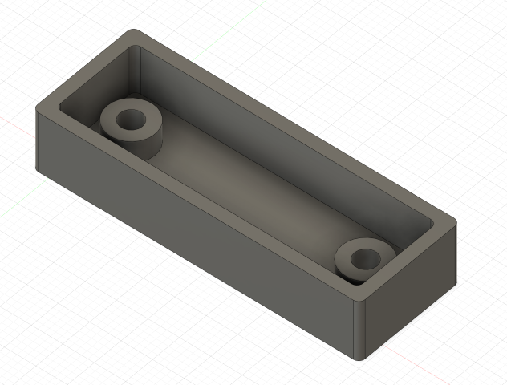

# JST XH splitter board for fan

A simple JST XH splitter pcb board to connect two chamber fans to one controller board pin and a case to hold the pcb which accepts m3 screws which you can pass through and hook upto 2020 extrusions using m3 t-nut. I built this for my voron trident build as a pcb is much cleaner way to connect the jst connectors compared to just soldering wires to the pins. We dont want the wires to short someday damaging the controller board and causing further issues. 

## pcb 

## case image 

updated case v3 with supports 

